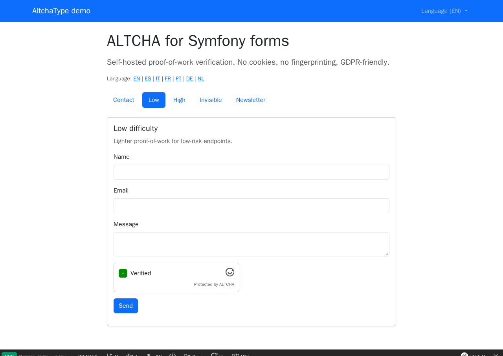

# Altcha Type Bundle

[](https://github.com/nowo-tech/AltchaTypeBundle/actions/workflows/ci.yml) [](https://packagist.org/packages/nowo-tech/altcha-type-bundle) [](https://packagist.org/packages/nowo-tech/altcha-type-bundle) [](LICENSE) [](https://php.net) [](https://symfony.com) [](https://github.com/nowo-tech/AltchaTypeBundle) [](#tests-and-coverage)

> ⭐ **Found this useful?** Give it a **star** on [GitHub](https://github.com/nowo-tech/AltchaTypeBundle) so more developers can find it.

**Symfony FormType for [ALTCHA](https://altcha.org/)** — a privacy-friendly, self-hosted proof-of-work CAPTCHA alternative for forms. No cookies, no fingerprinting, GDPR-friendly. Drop-in `AltchaType` field with named difficulty profiles, Twig themes, and optional Stimulus. For **Symfony 6, 7 and 8** · PHP 8.2+.


This bundle is **FrankenPHP worker mode friendly** (kernel reused / `FRANKENPHP_RESET_KERNEL` unset or `0`). See [docs/FRANKENPHP-WORKER-AUDIT.md](docs/FRANKENPHP-WORKER-AUDIT.md).

<table>
  <tr>
    <td align="center" width="50%">
      
      <br /><sub>ALTCHA proof-of-work field — ready to verify</sub>
    </td>
    <td align="center" width="50%">
      
      <br /><sub>ALTCHA verified — payload synced to the form</sub>
    </td>
  </tr>
</table>

## Table of contents

- [Quick search terms](#quick-search-terms)
- [Features](#features)
- [Installation](#installation)
- [Requirements](#requirements)
- [Configuration](#configuration)
- [Usage](#usage)
- [Demo](#demo)
- [Development](#development)
- [Documentation](#documentation)
- [Tests and coverage](#tests-and-coverage)
- [License](#license)
- [Author](#author)

## Quick search terms

Looking for **Symfony ALTCHA**, **ALTCHA FormType**, **privacy-friendly captcha Symfony**, **proof-of-work captcha**, **GDPR captcha self-hosted**, **AltchaType**, **anti-spam form Symfony**? You're in the right place.

## Features

- ✅ **`AltchaType`** — drop-in Symfony form field that renders the ALTCHA widget and validates the PoW payload
- ✅ **Challenge endpoint** — `GET /_nowo/altcha/challenge` issues signed challenges (must be `PUBLIC_ACCESS`)
- ✅ **Named profiles** — `default`, `low`, `high`, `contact`, `invisible` (REQ-CFG-001)
- ✅ **Server validation** — `AltchaValid` constraint via official `altcha-org/altcha` PHP library (v2, PBKDF2) and the ALTCHA v3 widget
- ✅ **ALTCHA v3 algorithms** — PBKDF2 (default), SHA, memory-hard **Argon2id** and **Scrypt** per profile (workers shipped)
- ✅ **Single-use payloads** — replay protection through a PSR-6 cache pool (enabled by default)
- ✅ **Profile-bound challenges** — the profile is signed into the challenge; cheaper solutions are rejected
- ✅ **Optional Sentinel** — remote verification (verdict is final; local fallback only on transport errors, opt-in)
- ✅ **Test mode** — `enable: false` skips verification (demo / PHPUnit)
- ✅ **Works with or without Stimulus** — built IIFE + MutationObserver, or a Stimulus controller
- ✅ **TypeScript + Vite + pnpm** — bundle IIFE is built with Vite; Symfony 8 demo uses **Pentatrion Vite** and **pnpm only**
- ✅ Compatible with **Symfony 6, 7 and 8** and **FrankenPHP**

## Installation

```bash
composer require nowo-tech/altcha-type-bundle
```

**1. Register the bundle** in `config/bundles.php`:

```php
<?php

return [
  // ...
  Nowo\AltchaTypeBundle\NowoAltchaTypeBundle::class => ['all' => true],
];
```

**2. Import routes** (attribute route for the challenge endpoint; the Flex recipe does this):

```yaml
# config/routes/nowo_altcha_type.yaml
nowo_altcha_type:
  resource: '@NowoAltchaTypeBundle/Controller/'
  type: attribute
```

If the app uses a global `access_control` that locks `^/`, allow the challenge path:

```yaml
access_control:
  - { path: ^/_nowo/altcha/challenge, roles: PUBLIC_ACCESS }
  # ...
```

**3. Form theme**: The bundle **automatically** prepends its form theme from the `form_theme` option (see Configuration).

**4. Frontend assets**: run `php bin/console assets:install`. With `include_script: true` (default) the widget emits its CSS/JS tags from the named asset package `nowo_altcha_type`. To include them yourself (or with `use_stimulus: true`, see [USAGE](docs/USAGE.md#stimulus-optional)):

```twig
<link rel="stylesheet" href="{{ asset(nowo_altcha_type_asset_path('altcha-type.css'), nowo_altcha_type_asset_package()) }}">
<script src="{{ asset(nowo_altcha_type_asset_path('altcha-type.js'), nowo_altcha_type_asset_package()) }}" defer></script>
```

**5. (Optional) Translations** — domain `NowoAltchaTypeBundle` with the seven required locales (`en`, `es`, `it`, `fr`, `pt`, `de`, `nl`).

Full steps: [docs/INSTALLATION.md](docs/INSTALLATION.md).

## Requirements

- PHP >= 8.2
- **Symfony 6, 7 or 8** (`^6.0 || ^7.0 || ^8.0`), including the mandatory floor **7.4**, **8.0**, and **8.1**
- **Stimulus** optional — use the built script, or register the controller
- **Vite** to rebuild assets (or use the pre-built files in `src/Resources/public`, which bundle the ALTCHA **v3** widget)
- When bundling the Stimulus controller yourself: npm `altcha` **^3.2** (the v3 widget speaks the protocol of `altcha-org/altcha` 2.x)

## Configuration

```yaml
nowo_altcha_type:
  enable: true
  hmac_signature: '%env(ALTCHA_HMAC_SIGNATURE)%' # generated by the Flex recipe
  hmac_algorithm: SHA-256
  default_profile: default
  form_theme: 'form_div_layout.html.twig'
  include_script: true
  use_stimulus: false
  debug: false
  replay_protection:
    cache_pool: cache.app # use a shared pool with several hosts
  profiles:
    default:
      cost: 5000
      counter_min: 5000
      counter_max: 10000
      timeout: 30.0
      expires: '+10 minutes'
      floating: false
      hide_logo: false
      hide_footer: false

when@test:
  nowo_altcha_type:
    enable: false
```

See [docs/CONFIGURATION.md](docs/CONFIGURATION.md) for profiles, replay protection, Sentinel and timeouts.

## Usage

```php
use Nowo\AltchaTypeBundle\Form\Type\AltchaType;
use Symfony\Component\Form\Extension\Core\Type\EmailType;
use Symfony\Component\Form\Extension\Core\Type\TextareaType;
use Symfony\Component\Form\Extension\Core\Type\TextType;

$builder
    ->add('name', TextType::class)
    ->add('email', EmailType::class)
    ->add('message', TextareaType::class)
    ->add('security', AltchaType::class, [
        'profile' => 'contact',
    ]);
```

Render with a child loop (REQ-TWIG-003 / REQ-TWIG-005):

```twig
{{ form_start(form) }}

    
        {{ form_row(child) }}
    

{{ form_end(form) }}
```

## Demo

```bash
make up-symfony8                        # http://localhost:8055 (FrankenPHP worker mode)
make -C demo/symfony8 test-e2e          # Playwright e2e (REQ-DEMO-013)
make -C demo/symfony8 demo-screenshots  # refreshes docs/images/demo/*.png
```

See [docs/DEMO-FRANKENPHP.md](docs/DEMO-FRANKENPHP.md).

## Development

```bash
composer install
pnpm install
pnpm run build
composer test
```

Root `make release-check` runs the full QA chain (REQ-MAKE-002).

## Documentation

- [Installation](docs/INSTALLATION.md)
- [Configuration](docs/CONFIGURATION.md)
- [Usage](docs/USAGE.md)
- [Contributing](docs/CONTRIBUTING.md)
- [Code of Conduct](CODE_OF_CONDUCT.md)
- [Changelog](docs/CHANGELOG.md)
- [Upgrading](docs/UPGRADING.md)
- [Release](docs/RELEASE.md)
- [Security](docs/SECURITY.md)
- [Engram](docs/ENGRAM.md)
- [Spec-driven development](docs/SPEC-DRIVEN-DEVELOPMENT.md)
- [GitHub Spec Kit](docs/SPEC-KIT.md)

### Additional documentation

- [Use cases](docs/USE-CASES.md) — which profile for which form
- [Theming](docs/THEMING.md) — form themes, CSS hooks, template overrides
- [Demo with FrankenPHP](docs/DEMO-FRANKENPHP.md) (includes worker mode)
- [FrankenPHP worker audit (`FRANKENPHP_RESET_KERNEL` unset/false)](docs/FRANKENPHP-WORKER-AUDIT.md)
- [GitHub Actions CI requirements](docs/GITHUB_CI.md)
- [PSR evaluation (REQ-CS-007)](docs/PSR.md)
- [GitHub About fields](docs/GITHUB.md)

## Tests and coverage

- Tests: PHPUnit (PHP), Vitest (TS/JS), Playwright (demo e2e)
- PHP: 100%
- TS/JS: 100%
- Python: N/A

```bash
make test-coverage   # PHPUnit + coverage-php.txt (.scripts/php-coverage-percent.sh)
make assets-test     # Vitest + coverage-ts.txt (.scripts/ts-coverage-percent.sh)
make coverage-check  # fails below 100% PHP lines
```

TS coverage excludes `src/Resources/assets/src/altcha-type.ts` (IIFE bootstrap that only wires `initAltchaContainer` to the DOM; its logic lives in the covered `altcha-type-lib.ts`).

## License

MIT — see [LICENSE](LICENSE).

## Author

[Nowo.tech](https://nowo.tech)
